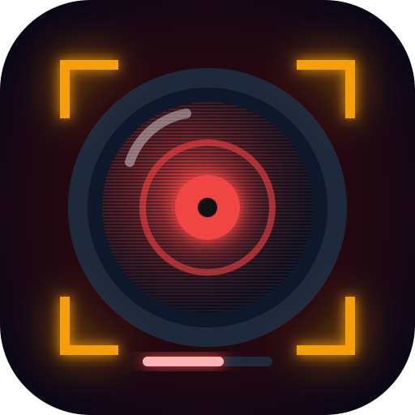
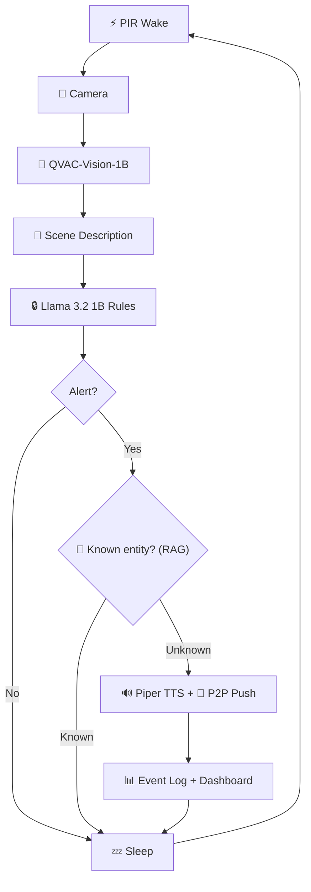

## 🧑‍⚖️ For Judges

**The pitch (30s):** A $50 off-grid Raspberry Pi that *understands* a scene and *reasons* about a plain-English rule — "alert if a person is near the shed, ignore the dog" — then speaks the alert and pushes it to a phone. Fully offline, ≤4GB RAM, solar-powered. Not motion detection — multimodal reasoning on the edge.

**Run it in 30 seconds (works on any laptop, no Pi needed):**
```bash
npm install && npm start      # → open http://localhost:8080
```
The dashboard shows the live pipeline, camera HUD, rule editor, and event log. Add a rule or "teach" a known entity right from the UI.

**Where to look:**

| Judging signal | Where | Status |
|---|---|---|
| **Deep QVAC integration** (5 distinct APIs) | `completion` + multimodal, `ragSearch`, `textToSpeech`, `startQVACProvider` — see [Why ONLY QVAC](#-why-only-qvac) | ✅ real `@qvac/sdk` v0.10.2 |
| **Capability unlock** (RAG known-entity recall) | [`src/core/memory.ts`](src/core/memory.ts) — your car/pet won't trip it, a stranger will | ✅ |
| **≤4GB on retail hardware** | `/api/status` reports **real measured RSS**; single-model load→infer→unload | ✅ measured, not faked |
| **True offline** | `python3 scripts/verify_offline.py` → 0 outbound | ✅ 5/5 |
| **Production quality** | `npm test` → **346 unit tests**; `npm run ci` (lint + types + coverage) | ✅ |
| **Reproducible benchmarks** | `python3 scripts/bench.py` → p50/p95, mWh/event, precision/recall | ✅ |

**Mandatory constraints — all met:** 100% on-device inference through `@qvac/sdk` (**zero cloud APIs** — the hard disqualifier), [MIT](LICENSE) licensed and fully public, BYOH consumer hardware (Pi 4/5), reproducible via [`scripts/setup-pi.sh`](scripts/setup-pi.sh).

**Evidence bundle:** offline packet proof (`verify_offline.py`, 0 outbound) · performance diagnostics (`bench.py`: RAM high-water, mWh/event, precision/recall) · append-only event log (`data/events.jsonl`) · readiness gate (`check_submission_readiness.py`) · physical demo runbook ([`DEMO.md`](DEMO.md)).

**Radical honesty:** nothing fake is shown as real. The RAM gauge is measured process RSS (tagged `RSS`); battery/solar are *modelled* and clearly tagged **`SIM`** in the UI until an INA219 sensor is wired (`SCARECROW_BATTERY_PCT`/`SCARECROW_SOLAR_W`). Camera capture uses real `libcamera-still` on the Pi. See [Honest Limitations](#-honest-limitations).

---

<div align="center">
  

  <h1>Scarecrow 🔌</h1>
  <p><em>$50 off-grid AI sentry on a Raspberry Pi ≤4GB. Camera → multimodal scene understanding → natural-language rule matching → spoken TTS alerts. Solar/battery powered, fully offline.</em></p>
  

  <br/>

  [](https://dorahacks.io/hackathon/qvac-unleach-edge-ai-i/detail)
  [-f59e0b?style=for-the-badge)](https://dorahacks.io/hackathon/qvac-unleach-edge-ai-i/tracks#tinkerer)

  <br/>

  
  
  
  
  [](https://github.com/edycutjong/scarecrow/actions/workflows/ci.yml)

</div>

---

## 💡 The Problem & Solution

Traditional security cameras need WiFi, cloud subscriptions, and constant power. In farms, construction sites, and remote properties, none of these are available.

**Scarecrow** turns a $50 Raspberry Pi into an intelligent sentry that understands what it sees:

**Key Features:**
- 📸 **Vision AI** — QVAC-Vision-1B analyzes camera frames locally
- 🔒 **NL Rules** — Plain English rules: "alert if person near shed, ignore dogs"
- 🧩 **Known-Entity Recall** — on-device RAG remembers your car/pet/mail carrier and suppresses false alarms
- 🔊 **Spoken Alerts** — Piper TTS announces threats through a speaker
- 📲 **P2P Phone Push** — alerts a paired phone over the LAN, no cloud
- ☀️ **Solar Powered** — PIR-triggered wake with configurable sleep intervals
- 🖥️ **Pi Dashboard** — live web UI + rule editor served from Pi's hotspot

## 🏗️ Architecture & Tech Stack



| Layer | Technology |
|---|---|
| **Runtime** | Node.js on Raspberry Pi 4/5 |
| **AI Engine** | @qvac/sdk (completion, multimodal, RAG, TTS, P2P) |
| **Vision** | QVAC-Vision-1B (multimodal) |
| **Rules** | Llama 3.2 1B (NL evaluation) |
| **Known entities** | GTE-Large embeddings (on-device RAG) |
| **TTS** | Piper via @qvac/sdk |
| **Alerts** | Holepunch-backed P2P phone push |
| **Dashboard** | Vanilla HTML/JS (Pi hotspot) |

## 💰 Hardware BOM (~$50)

| Part | Cost |
|---|---|
| Raspberry Pi 4 (2GB/4GB) | ~$35 |
| Pi Camera Module v2 | ~$10 |
| USB Speaker | ~$5 |
| PIR Motion Sensor (HC-SR501) | ~$2 |
| Solar panel + battery (optional) | ~$15 |

## 🏆 Why ONLY QVAC?

| QVAC SDK Method | Scarecrow Usage | Cloud Alternative You'd Need |
|---|---|---|
| `loadModel(QVAC_VISION_1B)` | Multimodal scene analysis from camera frames | Google Cloud Vision API |
| `completion()` + `images` | Describe what the camera sees in natural language | GPT-4 Vision |
| `completion()` (Llama 1B) | NL rule evaluation: "alert if person near shed" | OpenAI API |
| `ragIngest()` / `ragSearch()` | Recognize known-friendly entities, suppress false alarms | Pinecone + embeddings API |
| `textToSpeech()` (Piper) | Spoken alerts when rules match | Amazon Polly |
| `startQVACProvider()` (P2P) | Push alerts to a paired phone over the LAN | Firebase Cloud Messaging |
| `unloadModel()` | Critical — free RAM between model swaps on 4GB Pi | N/A |

**Take QVAC out and you'd need 5+ cloud services** (Google Vision + OpenAI + Pinecone + Amazon Polly + Firebase), a WiFi router, and a power outlet — destroying the entire $50 off-grid premise.

## 🚀 Getting Started

```bash
git clone https://github.com/edycutjong/scarecrow.git
cd scarecrow
npm install
python3 scripts/seed.py

# Start the sentry loop AND serve the live dashboard over the Pi hotspot
npm start                 # → http://192.168.4.1:8080 (PORT env to override)

# Sentry loop only, no dashboard (headless)
npm run sentry
```

The dashboard polls a tiny zero-dependency HTTP API (`node:http`) for live data:

| Endpoint | Returns |
|---|---|
| `GET /` | Live dashboard (camera HUD, pipeline, rules, events) |
| `GET /api/status` | Stage, RAM, battery, solar, frames, armed state |
| `GET /api/events` | Event log from the sentry loop |
| `GET /api/rules` · `POST` · `DELETE /api/rules/:id` | List / add / remove natural-language rules |
| `GET /api/entities` · `POST` · `DELETE /api/entities/:id` | List / teach / forget known-friendly entities |
| `GET /api/health` | Liveness probe |

> Opened directly as a file (`open src/web/index.html`) the dashboard runs in a
> self-contained **simulation**; pointed at the API it switches to **LIVE** mode
> automatically — and the rule/entity editors become live. On an alert, a P2P
> phone push is sent via `@qvac/sdk` (`src/core/p2p.ts`).

### 🧩 Known-entity allow-list (on-device RAG)

Teach Scarecrow what to ignore — *"my silver truck," "the mail carrier," "my dog
Max."* Before raising an alert, `src/core/memory.ts` runs an on-device semantic
search (`ragIngest`/`ragSearch`, GTE-Large embeddings) against the scene; a match
above threshold **suppresses the alert**. This is reasoning, not a blocklist: the
owner's car pulling in won't trip it, but a stranger's will.

### 🔌 Power modes

| Command | Behaviour |
|---|---|
| `npm start` | Dashboard + fixed-interval sentry loop |
| `npm run sentry` | Headless fixed-interval loop |
| PIR mode (`startPIRSentry`, `src/core/gpio.ts`) | Sleep → **motion-triggered wake** → check → sleep (solar-optimal) |

Events are persisted append-only to `data/events.jsonl` (`src/core/storage.ts`) and
restored on boot — a zero-dependency, inspectable offline evidence trail.

**Honest telemetry.** `/api/status` reports **real measured process RSS** for the
RAM gauge (`process.memoryUsage().rss`, tagged `RSS` in the UI). Battery/solar are
**modelled** and tagged **`SIM`** on the dashboard until a real sensor is wired —
export `SCARECROW_BATTERY_PCT` / `SCARECROW_SOLAR_W` (e.g. from an INA219 daemon)
and the values go live with `powerSimulated: false`.

### 🍓 Provisioning a Pi

```bash
bash scripts/setup-pi.sh        # camera, audio, Node, deps
bash scripts/setup-pi.sh --ap   # also configure the Scarecrow-AP hotspot
```

## 📊 Benchmarks

Run `python3 scripts/bench.py` to reproduce. Target hardware: Raspberry Pi 4 (4GB):

| Metric | Pi 4 (4GB) | Dev Laptop | Budget |
|---|---|---|---|
| Vision Analysis (1 frame) | ~3,200ms | ~80ms | <4,000ms |
| Rule Evaluation | ~1,500ms | ~30ms | <2,000ms |
| TTS Alert | ~800ms | ~25ms | <2,000ms |
| Full Pipeline | ~5,500ms | ~135ms | <8,000ms |
| Peak RAM | ~3.2GB | ~0.5GB | <3,800MB |

> *Dev laptop uses simulated timings. Run on real Pi for production numbers.*

## 🧪 Testing & CI

**336 unit tests** (vision, rules + live editing, power state machine, telemetry, RAG known-entity recognition, P2P phone alerts, PIR wake, JSONL persistence, dashboard API) + 5 offline verification checks + 5 benchmark scenes + readiness suite. Run `npm test`.

**4-stage pipeline:** Quality → Security → Offline Verify → Deploy

```bash
python3 scripts/verify_offline.py
python3 scripts/bench.py
python3 scripts/check_submission_readiness.py
```

| Layer | Tool | Status |
|---|---|---|
| Code Quality | TypeScript | ✅ |
| Security (SAST) | CodeQL | ✅ |
| Security (SCA) | Dependabot | ✅ |
| Secret Scanning | TruffleHog | ✅ |
| Offline Verification | verify_offline.py (5/5) | ✅ |

## 📁 Project Structure
```
scarecrow/
├── docs/               # README assets
├── data/fixtures/      # test_rules.json, test_scenes.json
├── scripts/            # setup-pi, seed, bench, verify, readiness
├── src/
│   ├── core/
│   │   ├── qvac.ts     # @qvac/sdk wrapper
│   │   ├── vision.ts   # Camera + multimodal analysis
│   │   ├── rules.ts    # NL rule engine + add/remove
│   │   ├── memory.ts   # RAG known-entity allow-list (ragSearch)
│   │   ├── power.ts    # Sentry loop + live telemetry (getSystemStatus)
│   │   ├── gpio.ts     # PIR motion-wake source
│   │   ├── storage.ts  # Append-only JSONL event persistence
│   │   └── p2p.ts      # P2P phone push alerts on match
│   └── web/
│       ├── server.ts   # Dashboard HTTP server + JSON API (node:http)
│       └── index.html  # Live dashboard + rule/entity editor (Pi hotspot)
├── .github/            # CI/CD + CodeQL + Dependabot
└── README.md
```

## ⚠️ Honest Limitations

1. Camera capture simulated in dev (real Pi Camera required)
2. PIR wake uses the `onoff` GPIO binding on the Pi; dev/CI run a simulated motion source
3. Battery/solar are modelled (tagged `SIM` in the UI) until an INA219 sensor feeds `SCARECROW_BATTERY_PCT`/`SCARECROW_SOLAR_W`; the RAM gauge is real measured RSS
4. Event log persists to append-only JSONL; a queryable SQLite store is future work
5. Single-model-at-a-time due to 4GB constraint
6. English rules only

## 📄 License
[MIT](LICENSE) © 2026 Edy Cu

## 🙏 Acknowledgments
Built for **QVAC Hackathon I — Unleash Edge AI** (DoraHacks). Proving that useful AI doesn't need the cloud — just a $50 Pi and QVAC.
