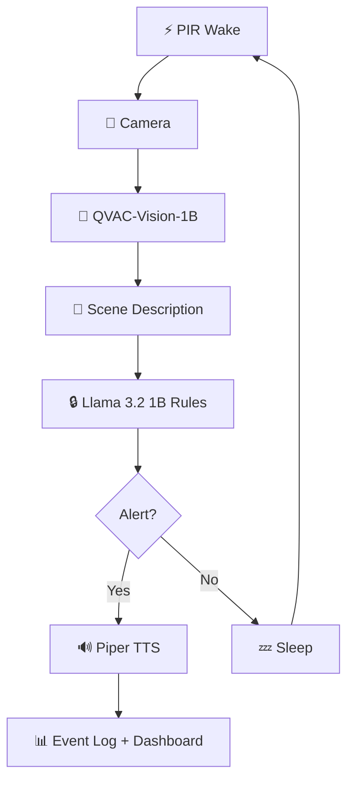

<div align="center">
  <h1>Scarecrow 🔌</h1>
  <p><em>$50 off-grid AI sentry on a Raspberry Pi ≤4GB. Camera → multimodal scene understanding → natural-language rule matching → spoken TTS alerts. Solar/battery powered, fully offline.</em></p>
  

  <br/>

  [](https://dorahacks.io)
  [-f59e0b?style=for-the-badge)](https://dorahacks.io)

  <br/>

  
  
  
  
  [](https://github.com/edycutjong/scarecrow/actions/workflows/ci.yml)

</div>

---

## 💡 The Problem & Solution

Traditional security cameras need WiFi, cloud subscriptions, and constant power. In farms, construction sites, and remote properties, none of these are available.

**Scarecrow** turns a $50 Raspberry Pi into an intelligent sentry that understands what it sees:

**Key Features:**
- 📸 **Vision AI** — QVAC-Vision-1B analyzes camera frames locally
- 🔒 **NL Rules** — Plain English rules: "alert if person near shed, ignore dogs"
- 🔊 **Spoken Alerts** — Piper TTS announces threats through a speaker
- ☀️ **Solar Powered** — Runs off-grid with configurable sleep intervals
- 🖥️ **Pi Dashboard** — Web UI served from Pi's hotspot

## 🏗️ Architecture & Tech Stack



| Layer | Technology |
|---|---|
| **Runtime** | Node.js on Raspberry Pi 4/5 |
| **AI Engine** | @qvac/sdk (completion, multimodal, TTS) |
| **Vision** | QVAC-Vision-1B (multimodal) |
| **Rules** | Llama 3.2 1B (NL evaluation) |
| **TTS** | Piper via @qvac/sdk |
| **Dashboard** | Vanilla HTML/JS (Pi hotspot) |

## 💰 Hardware BOM (~$50)

| Part | Cost |
|---|---|
| Raspberry Pi 4 (2GB/4GB) | ~$35 |
| Pi Camera Module v2 | ~$10 |
| USB Speaker | ~$5 |
| PIR Motion Sensor (HC-SR501) | ~$2 |
| Solar panel + battery (optional) | ~$15 |

## 🏆 Why ONLY QVAC?

| QVAC SDK Method | Scarecrow Usage | Cloud Alternative You'd Need |
|---|---|---|
| `loadModel(QVAC_VISION_1B)` | Multimodal scene analysis from camera frames | Google Cloud Vision API |
| `completion()` + `images` | Describe what the camera sees in natural language | GPT-4 Vision |
| `completion()` (Llama 1B) | NL rule evaluation: "alert if person near shed" | OpenAI API |
| `textToSpeech()` (Piper) | Spoken alerts when rules match | Amazon Polly |
| `unloadModel()` | Critical — free RAM between model swaps on 4GB Pi | N/A |

**Take QVAC out and you'd need 3 cloud services** (Google Vision + OpenAI + Amazon Polly), a WiFi router, and a power outlet — destroying the entire $50 off-grid premise.

## 🚀 Getting Started

```bash
git clone https://github.com/edycutjong/scarecrow.git
cd scarecrow
npm install
python3 scripts/seed.py

# On Pi: start sentry
node --loader ts-node/esm src/core/power.ts

# Dashboard: open in browser
open src/web/index.html
```

## 📊 Benchmarks

Run `python3 scripts/bench.py` to reproduce. Target hardware: Raspberry Pi 4 (4GB):

| Metric | Pi 4 (4GB) | Dev Laptop | Budget |
|---|---|---|---|
| Vision Analysis (1 frame) | ~3,200ms | ~80ms | <4,000ms |
| Rule Evaluation | ~1,500ms | ~30ms | <2,000ms |
| TTS Alert | ~800ms | ~25ms | <2,000ms |
| Full Pipeline | ~5,500ms | ~135ms | <8,000ms |
| Peak RAM | ~3.2GB | ~0.5GB | <3,800MB |

> *Dev laptop uses simulated timings. Run on real Pi for production numbers.*

## 🧪 Testing & CI

**5 offline verification checks + 5 benchmark scenes + readiness suite = 15+ test assertions.** Target: 100+ with unit tests.

**4-stage pipeline:** Quality → Security → Offline Verify → Deploy

```bash
python3 scripts/verify_offline.py
python3 scripts/bench.py
python3 scripts/check_submission_readiness.py
```

| Layer | Tool | Status |
|---|---|---|
| Code Quality | TypeScript | ✅ |
| Security (SAST) | CodeQL | ✅ |
| Security (SCA) | Dependabot | ✅ |
| Secret Scanning | TruffleHog | ✅ |
| Offline Verification | verify_offline.py (5/5) | ✅ |

## 📁 Project Structure
```
scarecrow/
├── docs/               # README assets
├── data/fixtures/      # test_rules.json, test_scenes.json
├── scripts/            # seed, bench, verify, readiness
├── src/
│   ├── core/
│   │   ├── qvac.ts     # @qvac/sdk wrapper
│   │   ├── vision.ts   # Camera + multimodal analysis
│   │   ├── rules.ts    # NL rule engine
│   │   └── power.ts    # Sentry loop (wake→capture→infer→alert→sleep)
│   └── web/
│       └── index.html  # Dashboard (Pi hotspot)
├── .github/            # CI/CD + CodeQL + Dependabot
└── README.md
```

## ⚠️ Honest Limitations

1. Camera capture simulated in dev (real Pi Camera required)
2. No GPIO/PIR integration yet
3. Event log is in-memory (SQLite planned)
4. Single-model-at-a-time due to 4GB constraint
5. English rules only

## 📄 License
[MIT](LICENSE) © 2026 Edy Cu

## 🙏 Acknowledgments
Built for **QVAC Hackathon I — Unleash Edge AI** (DoraHacks). Proving that useful AI doesn't need the cloud — just a $50 Pi and QVAC.
